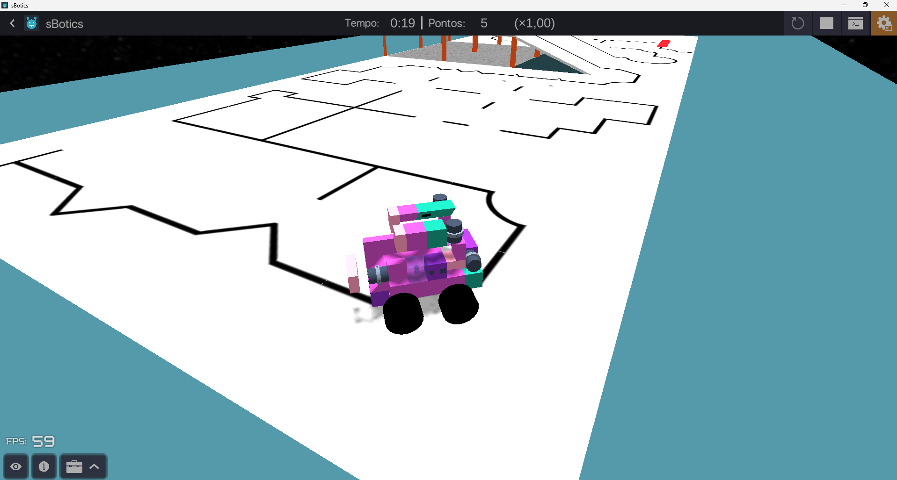

<div align="center">

# 🤖 OBR 2026 — Robô de Simulação

**Robô autônomo de resgate desenvolvido para a etapa de Simulação da Olimpíada Brasileira de Robótica 2026**

[](https://sbotics.net/)
[](https://learn.microsoft.com/pt-br/dotnet/csharp/)
[](LICENSE)
[](https://www.obr.org.br/)

</div>

---

## 📖 Sobre o projeto

Este repositório contém o código-fonte, as configurações de robô e as arenas utilizadas pela equipe na **etapa de Simulação da OBR 2026**, disputada na plataforma [sBotics](https://sbotics.net/).

O robô foi projetado para navegar de forma **totalmente autônoma** por arenas de resgate, seguindo a linha preta utilizando um **controlador proporcional (P)** com quatro sensores de cor, além de acionar braços mecânicos para simular o **resgate de vítimas** ao longo do percurso.

### ✨ Destaques técnicos

| Recurso | Detalhe |
|---|---|
| 🧮 Controle | Controlador proporcional (ganho `kp = 3.5`) |
| 🔵 Sensores | 4 sensores de cor (LL, L, R, RR) com ponderação lateral |
| ⚙️ Motores | 4 servomotores de tração + 2 braços de resgate |
| 🗺️ Arenas | 4 arenas customizadas de diferentes dificuldades |
| 🤖 Robôs | 2 configurações de robô (`.sBot`) |

---

## 📸 Demonstração

<div align="center">



*O robô percorre a arena de forma autônoma — **0:19 de tempo**, **5 pontos** marcados, rodando a 59 FPS*

</div>

---

## ⚙️ Pré-requisitos e Instalação

### Requisitos mínimos de sistema

- **Sistema operacional:** Windows ou Linux
- **RAM:** mínimo 4 GB
- **Processador:** moderno (geração recente, 64-bit)
- **Conta:** cadastro gratuito em [sbotics.net](https://sbotics.net/)

### Passo a passo de instalação

1. Acesse **[sbotics.net](https://sbotics.net/)** e crie sua conta gratuita.
2. Faça o download do instalador para o seu sistema operacional.
3. Execute o instalador e siga as instruções na tela.
4. Abra o sBotics e faça login com sua conta.

---

## 🚀 Como usar

### 1. Importar o robô

1. No sBotics, acesse a seção **Robôs**.
2. Clique em **Importar** e selecione um dos arquivos da pasta `robots/`:

| Arquivo | Descrição |
|---|---|
| `newestSbotics.sBot` | ✅ Versão mais recente — **recomendada** |
| `Werther.sBot` | Versão alternativa / experimental |

### 2. Importar uma arena

1. Acesse a seção **Arenas** e clique em **Importar**.
2. Escolha uma arena da pasta `arenas/` de acordo com a dificuldade desejada:

| Arena | Dificuldade | Descrição |
|---|---|---|
| `greenPlay.sArena` | ⭐ Iniciante | Arena principal de treino e validação |
| `90obstacle.sArena` | ⭐⭐ Médio | Curvas em 90° e obstáculos |
| `Myckey.sArena` | ⭐⭐⭐ Avançado | Percurso complexo e desafiador |
| `pesadelo_para_cinco.sArena` | ⭐⭐⭐⭐ Extremo | Alta dificuldade — teste de estresse |

### 3. Carregar o código

1. Com o robô posicionado na arena, abra o **Editor de Código** no sBotics.
2. Importe ou cole o conteúdo do arquivo `codes/simulation.cs`.
3. Clique em **Executar**.

### 4. Resultado esperado

O robô executa a seguinte sequência ao iniciar:

```
1. Braços de resgate sobem (upArms)
2. Motores são desbloqueados
3. Robô avança pela pista
4. Loop principal: leitura dos sensores → cálculo do erro → correção de trajetória
5. Valor do erro é exibido no terminal em tempo real
```

---

## 🧠 Como o código funciona

O arquivo [`codes/simulation.cs`](codes/simulation.cs) implementa a lógica de controle do robô em três camadas:

### Controle proporcional (P)

Quatro sensores de cor leem o brilho da pista em tempo real. O erro é calculado pela diferença ponderada entre os lados direito e esquerdo, e corrigido proporcionalmente:

```csharp
// Cálculo do erro — sensores externos têm peso 1.5x
error = (colorRR.Analog.Brightness * 1.5 + colorR.Analog.Brightness) / 2
      - (colorL.Analog.Brightness  + colorLL.Analog.Brightness * 1.5) / 2;

// Correção proporcional aplicada aos motores
p = error * kp;          // kp = 3.5
run(force, speed + p, speed - p);
```

### Parâmetros de controle

| Parâmetro | Valor | Função |
|---|---|---|
| `kp` | `3.5` | Ganho proporcional |
| `speed` | `175` | Velocidade base dos motores |
| `force` | `500` | Força aplicada aos motores |

### Arquitetura de funções

```
Main()
 ├── lockMotors(false)      → desbloqueia motores de tração
 ├── lockArms(false)        → desbloqueia braços de resgate
 ├── upArms(500, 150)       → ergue os braços
 └── loop while(true)
      ├── lê sensores de cor
      ├── calcula erro proporcional
      └── run() → aplica velocidades corrigidas
```

---

## 📁 Estrutura do projeto

```
Sbotics_read/
│
├── README.md                       # Documentação do projeto
├── LICENSE                         # Licença MIT
│
├── assets/
│   └── demo.png                    # Captura do robô em execução
│
├── codes/
│   └── simulation.cs               # Código principal do robô (C#)
│
├── robots/
│   ├── newestSbotics.sBot          # Configuração mais recente do robô
│   └── Werther.sBot                # Configuração alternativa
│
└── arenas/
    ├── greenPlay.sArena            # Arena de treino (iniciante)
    ├── 90obstacle.sArena           # Arena com curvas em 90°
    ├── Myckey.sArena               # Arena avançada
    └── pesadelo_para_cinco.sArena  # Arena extrema
```

---

## 👥 Equipe

Desenvolvido com 💙 para a **OBR 2026 — Modalidade Simulação**.

| Nome | Contribuição |
|---|---|
| **Maurício Calvet** | Programação e estratégia de controle |
| **Lucas Benjamin** | Programação e estratégia de controle |
| **Huan Lin Fui** | Programação e estratégia de controle |
| **Arthur Martins** | Programação e estratégia de controle |

---

## 📄 Licença

Distribuído sob a licença **MIT**. Consulte o arquivo [LICENSE](LICENSE) para mais informações.

---

<div align="center">

*Feito para a [Olimpíada Brasileira de Robótica 2026](https://www.obr.org.br/) — Modalidade Simulação*

</div>
